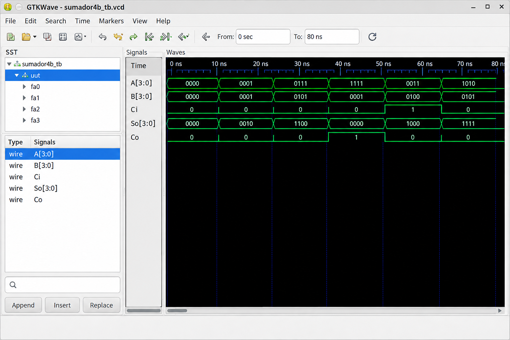

        
## Lab01 - Sumador/Restador de 4 bits

## INTEGRANTES

* David Orlando Torres
  https://github.com/davidortorresto-lab

* Luis Cuervo
  https://github.com/luis-cuervo

 ## INFORME

## ÍNDICE

1. Documentación del diseño implementado
2. Simulaciones
3. Evidencias de implementación
4. Preguntas
5. Conclusiones
6. Referencias

============================================================
## 1. DOCUMENTACIÓN DEL DISEÑO IMPLEMENTADO
============================================================

------------------------------------------------------------
# 1.1 SUMADOR DE 1 BIT (MÓDULO BASE)
------------------------------------------------------------

# 1.1.1 DESCRIPCIÓN

El sumador completo de 1 bit es el bloque fundamental para realizar
operaciones aritméticas. Recibe dos operandos de 1 bit (A y B) junto
a un acarreo de entrada (Ci), produciendo una salida de suma (So)
y un acarreo de salida (Co).

EXPRESIONES LÓGICAS

So = A XOR B XOR Ci

Co = (A AND B) OR (Ci AND (A XOR B))

# 1.1.2 CÓDIGO VERILOG

// Módulo base: Sumador de 1 bit usando operadores lógicos

module full_adder_1bit (

    input  wire A,
    input  wire B,
    input  wire Ci,

    output wire So,
    output wire Co

);

    assign So = A ^ B ^ Ci;

    assign Co = (A & B) | (Ci & (A ^ B));

endmodule

------------------------------------------------------------
## 2. SUMADOR ESTRUCTURAL DE 4 BITS
------------------------------------------------------------

# 2.1 DESCRIPCIÓN

Para sumar vectores de 4 bits (A[3:0] y B[3:0]), se instancian
4 bloques del sumador de 1 bit interconectando los acarreos en cadena
(Ripple Carry).

# 2.2 CÓDIGO VERILOG

module adder_4bit (

    input  wire [3:0] A,
    input  wire [3:0] B,
    input  wire       Ci,

    output wire [3:0] So,
    output wire       Co

);

    wire c1, c2, c3;

    full_adder_1bit fa0 (

        .A(A[0]),
        .B(B[0]),
        .Ci(Ci),
        .So(So[0]),
        .Co(c1)

    );

    full_adder_1bit fa1 (

        .A(A[1]),
        .B(B[1]),
        .Ci(c1),
        .So(So[1]),
        .Co(c2)

    );

    full_adder_1bit fa2 (

        .A(A[2]),
        .B(B[2]),
        .Ci(c2),
        .So(So[2]),
        .Co(c3)

    );

    full_adder_1bit fa3 (

        .A(A[3]),
        .B(B[3]),
        .Ci(c3),
        .So(So[3]),
        .Co(Co)

    );

endmodule

------------------------------------------------------------
## 3. SUMADOR/RESTADOR DE 4 BITS
------------------------------------------------------------

# 3.1 DESCRIPCIÓN

Utiliza la representación en complemento a 2 para realizar restas
mediante sumas.

A - B = A + (~B + 1)

Si Sel = 0:

Las compuertas XOR dejan pasar B sin cambios y Ci = 0.

Operación: SUMA

Si Sel = 1:

Las compuertas XOR invierten B y Ci = 1, completando la conversión
a complemento a 2.

Operación: RESTA

# 3.2 CÓDIGO VERILOG

module add_sub_4bit (

    input  wire [3:0] A,
    input  wire [3:0] B,
    input  wire       Sel,

    output wire [3:0] So,
    output wire       Co

);

    wire [3:0] B_xor;

    assign B_xor[0] = B[0] ^ Sel;

    assign B_xor[1] = B[1] ^ Sel;

    assign B_xor[2] = B[2] ^ Sel;

    assign B_xor[3] = B[3] ^ Sel;

    adder_4bit adder (

        .A(A),

        .B(B_xor),

        .Ci(Sel),

        .So(So),

        .Co(Co)

    );

endmodule

============================================================
## 2. SIMULACIONES
============================================================

------------------------------------------------------------
## 2.1 SIMULACIÓN DEL SUMADOR DE 1 BIT
------------------------------------------------------------

## 2.1.1 DESCRIPCIÓN

Se probó la combinación de todas las entradas del sumador de 1 bit
comprobando que coincidan con la tabla de verdad.

------------------------------------------------------------
## 2.2 SIMULACIÓN DEL SUMADOR DE 4 BITS
------------------------------------------------------------

## 2.2.1 DESCRIPCIÓN

Se verificó la propagación del acarreo aplicando sumas
representativas.

Ejemplos:

15 + 1

7 + 5

------------------------------------------------------------
## 2.3 SIMULACIÓN DEL SUMADOR/RESTADOR DE 4 BITS
------------------------------------------------------------

# 2.3.1 DESCRIPCIÓN

Se evaluaron operaciones en modo suma (Sel = 0) y en modo resta
(Sel = 1), comprobando la aritmética de enteros signados e
insignados.

# 2.3.2 DIAGRAMA / FORMAS DE ONDA

Capturas de pantalla o logs de consola generados por el simulador
de Quartus, ModelSim o EDA Playground.

CASO SUMA: 7 + 5

A = 0111

B = 0101

Sel = 0

Resultado:

So = 1100

So = 12

Co = 0

CASO RESTA: 7 - 5

A = 0111

B = 0101

Sel = 1

Resultado:

So = 0010

So = 2

Co = 1

CASO RESTA NEGATIVA: 3 - 7

A = 0011

B = 0111

Sel = 1

Resultado:

So = 1100

So = -4 en complemento a 2

Co = 0

============================================================
## 3. EVIDENCIAS DE IMPLEMENTACIÓN
============================================================

El proyecto fue sintetizado mediante el IDE Intel Quartus Prime y
cargado en la tarjeta de desarrollo FPGA MAX 10.

ENTRADAS

A[3:0]:

Conectados a los interruptores deslizantes SW[3:0].

B[3:0]:

Conectados a los interruptores deslizantes SW[7:4].

Sel:

Conectado al interruptor SW[9].

SALIDAS

So[3:0]:

Mapeados a los LEDs LEDR[3:0].

Co:

Mapeado al LED LEDR[9].

============================================================
## 4. PREGUNTAS
============================================================

# 1. ¿CÓMO AFECTA LA PROPAGACIÓN DEL ACARREO (RIPPLE CARRY)
   AL RENDIMIENTO DEL CIRCUITO?

El acarreo debe propagarse secuencialmente desde el bit menos
significativo (LSB) hasta el más significativo (MSB).

A medida que el número de bits aumenta, el retardo de propagación
acumulado limita la frecuencia máxima de operación del sistema
digital.

------------------------------------------------------------

# 2. ¿POR QUÉ EL INDICADOR DE ACARREO FINAL Co = 1 EN UNA RESTA
   INDICA QUE EL RESULTADO ES POSITIVO?

Debido a la propiedad del complemento a 2:

A - B = A + ~B + 1

Cuando A >= B, la suma resultante desborda el rango de 4 bits
produciendo un acarreo de salida.

Co = 1

Cuando A < B, no se genera acarreo.

Co = 0

Esto indica que el resultado es negativo y está expresado en
complemento a 2.

============================================================
## 5. CONCLUSIONES
============================================================

- La metodología de diseño estructural basada en la instanciación
  modular permitió escalar exitosamente desde un circuito
  combinacional simple de 1 bit hasta un sistema aritmético
  jerárquico de 4 bits.

- La reutilización de hardware mediante el uso de compuertas XOR
  y el acarreo de entrada permitió unificar las operaciones de
  suma y resta en un único bloque funcional eficiente.

- Se validó que la simulación funcional es una etapa crítica previa
  al despliegue físico en la FPGA, garantizando la detección
  oportuna de errores lógicos y de asignación de puertos.

============================================================
## 6. REFERENCIAS
============================================================

- Mano, M. M., & Ciletti, M. D. (2013).

  Digital Design: With an Introduction to the Verilog HDL.

  Pearson.

- Intel Corporation.

  MAX 10 FPGA Device Overview.

  Documentación técnica de Quartus Prime.